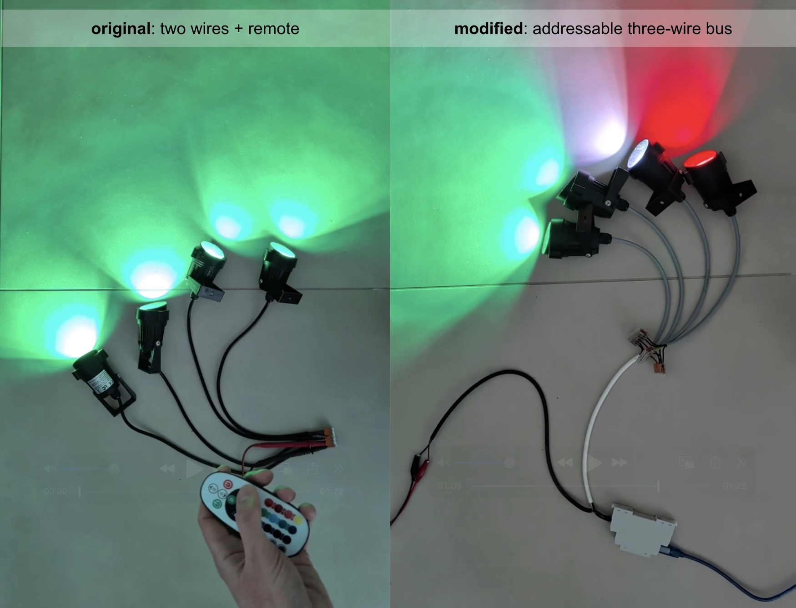
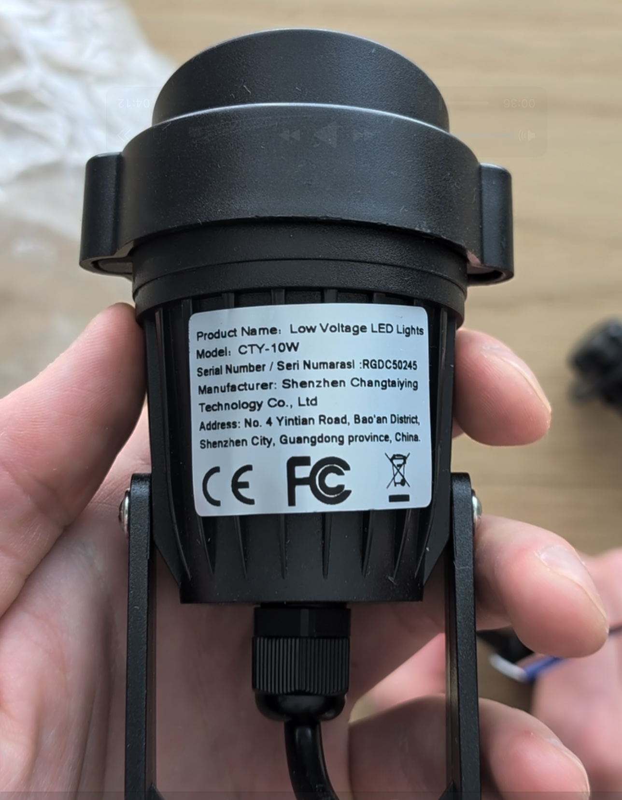
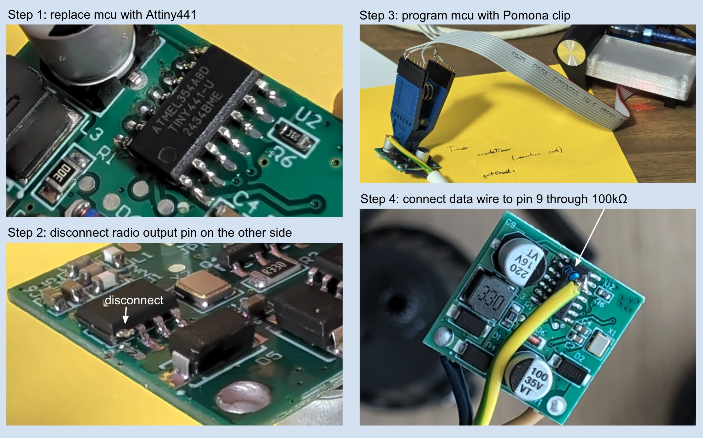
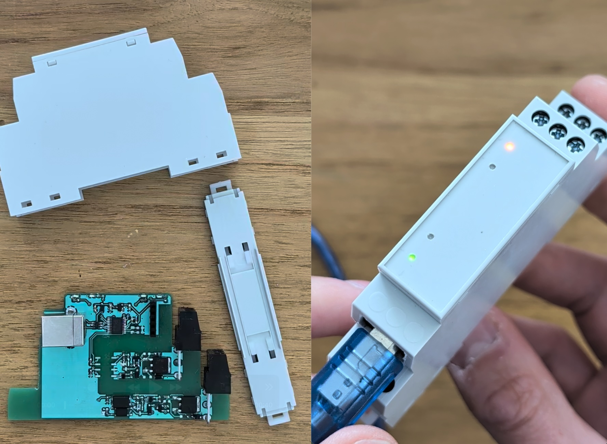

# Temu garden lights hack

I bought 12V-24V outdoor garden lights from Temu. Originally, they had two wires and a remote controller. I modified them to use an addressable three-wire bus (0V, data, 24V) to control them from my smart home. <a href="https://www.youtube.com/shorts/Vp0UermeDtU">Here</a>'s a short youtube video that shows the process and the result. 

Disclaimer: All electrical modifications are performed at your own risk.

### Reverse engineering the lamp

<table border="0">
  <tr>
    <td valign="top">
      
    </td>
    <td valign="top">
      <ul>
        <li><strong>Product Name:</strong> Low Voltage LED Lights</li>
        <li><strong>Model:</strong> CTY-10W</li>
        <li><strong>Serial Number / Seri Numarasi:</strong> RGDC50245</li>
        <li><strong>Manufacturer:</strong> Shenzhen Changtaiying Technology Co., Ltd</li>
        <li><strong>Address:</strong> No. 4 Yintian Road, Bao'an District, Shenzhen City, Guangdong province, China.</li>
      </ul>
    </td>
  </tr>
</table>

Originally, the lamp had an FMD FT60E122 microcontroller in an SO-14 package with the following pinout:

<table border="0">
  <tr>
    <td>
      <table>
        <thead>
          <tr><th>#</th><th>Function</th></tr>
        </thead>
        <tbody>
          <tr><td>1</td><td>VDD (5V)</td></tr>
          <tr><td>2</td><td>Crystal1 (16 MHz)</td></tr>
          <tr><td>3</td><td>Crystal2</td></tr>
          <tr><td>4</td><td>radio recv</td></tr>
          <tr><td>5</td><td>Red PWM 62.8μs (10μs max)</td></tr>
          <tr><td>6</td><td>White PWM 62.8μs (49.2μs max)</td></tr>
          <tr><td>7</td><td>not connected</td></tr>
          <tr><td>8</td><td>Green PWM 62.8μs (49.2μs max)</td></tr>
          <tr><td>9</td><td>not connected</td></tr>
          <tr><td>10</td><td>not connected</td></tr>
          <tr><td>11</td><td>Blue PWM 62.8μs (49.2μs max)</td></tr>
          <tr><td>12</td><td>test point 2</td></tr>
          <tr><td>13</td><td>test point 1</td></tr>
          <tr><td>14</td><td>GND</td></tr>
        </tbody>
      </table>
    </td>
    <td valign="top">
      
    </td>
  </tr>
</table>

### Conversion

Luckily, this mcu is pin-compatible with the Attiny441. These are the steps I did:

### Custom bus physical description
The custom bus uses three wires: 0V, data, 24V. Logical 0: < 1.5V. Logical 1: 3V-24V. Data format: 10000 baud 8N1. The data line is connected to 24V through a 20mA current limiter in the controller. Max cable length: 200m, number of nodes: 31. To send, every node can pull the data line to zero. Currently, the lamps can only receive but not send. For this reason, their address must be hardcoded during programming like so:
<code>make program LAMP_ADDRESS=0</code>.

I used a 3x0.75mm² ÖLFLEX® CLASSIC 400 P cable. It has the same diameter as the original two-wire cable, but can be used outdoors unlike the original.

### Data Frame Formats
| Size [byte] | Format A | Size [byte] | Format B |
| :---: | :--- | :---: | :--- |
| 1 | 0 < length <= 30 | 1 | length + 32 |
| max 60 | 4x4 bit RGBW | max 30 | 2x4 bit RGBW |
| 2 | fade time in ms | 2 | fade time in ms |
| 1 | brightness | 1 | brightness |
| 1 | CRC | 1 | CRC |

There must be a 2ms pause between frames.

### The controller
The controller is a DIN rail mounted USB HID device with a cheap STM32C071 mcu. It can be used with a Raspberry Pi + node.js or python without a driver. It can handle two bus lines with 30 lamps each. Build it or use it at your own risk only.

## Licensing

- **Software:** Licensed under the [MIT License](https://opensource.org/license/mit)
- **Hardware & Documentation:** Licensed under [CERN-OHL-P](https://ohwr.org/project/cernohl/wikis/Documents/CERN-OHL-version-2) / [CC-BY-4.0](https://creativecommons.org/licenses/by/4.0/)

Basically: feel free to use, modify, and share this project, but keep the attribution and don't sue me if something breaks.
